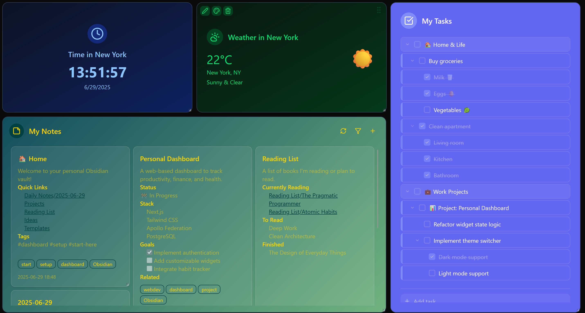

# Ernestas Dashboard

Work in Progress

Ernestas Dashboard is a modular, full-stack platform for building customizable, secure, and extensible personal dashboards. It integrates multiple microservices for authentication, widgets, notes, and tasks, all orchestrated through a federated GraphQL gateway and a modern Next.js frontend.



## Purpose

The project aims to provide a robust, extensible dashboard for personal productivity, supporting:

-   Secure authentication (OAuth2, JWT)
-   Customizable widgets (clock, weather, notes, tasks, etc.)
-   Note-taking with Obsidian integration
-   Task management with advanced hierarchy and filtering
-   Real-time, federated GraphQL API
-   Observability and monitoring (Sentry, ELK stack)

## Services & Their Purpose

-   **frontend/**: Next.js/React UI for the dashboard. Handles user interaction, widget layout, authentication, and data visualization.
-   **gateway/**: Apollo Gateway (Node.js/TypeScript) federates all backend GraphQL APIs, handles authentication, CSRF, logging, and security.
-   **backend/auth/**: Spring Boot service for authentication (OAuth2, JWT), user management, and refresh token rotation.
-   **backend/widget-registry/**: NestJS/Prisma service for widget CRUD, layout, and configuration. Supports multiple widget types.
-   **backend/notes/**: FastAPI/Strawberry service for note CRUD, with optional Obsidian vault sync.
-   **backend/tasks/**: ASP.NET Core/HotChocolate service for advanced task management, hierarchy, and filtering.
-   **ELK stack**: (Optional) Elasticsearch, Logstash, Kibana for centralized logging and monitoring.
-   **Apache Kafka**: Interservice communication.

## Service TODO Lists

Each service maintains its own TODO list for tracking improvements and future features:

-   **[Frontend TODO](./frontend/TODO.md)**
-   **[Gateway TODO](./gateway/TODO.md)**
-   **[Auth TODO](./backend/auth/TODO.md)**
-   **[Widget Registry TODO](./backend/widget-registry/TODO.md)**
-   **[Notes TODO](./backend/notes/TODO.md)**
-   **[Tasks TODO](./backend/tasks/TODO.md)**

## Technologies Used

-   **Frontend**: Next.js, React, TypeScript, Tailwind CSS, Apollo Client, Vitest, Testing Library
-   **Gateway**: Node.js, Apollo Gateway, Express, TypeScript, Sentry, Zod
-   **Auth**: Spring Boot, Java, Spring Security, OAuth2, JWT, PostgreSQL
-   **Widget Registry**: NestJS, TypeScript, Apollo Federation, Prisma, PostgreSQL
-   **Notes**: FastAPI, Python, Strawberry GraphQL, SQLAlchemy (async), PostgreSQL
-   **Tasks**: ASP.NET Core, C#, HotChocolate GraphQL, EF Core, PostgreSQL
-   **Observability**: Sentry, ELK (Elasticsearch, Logstash, Kibana)
-   **Deployability**: Docker, GitHub Actions, nginx
-   **Communication**: Apache Kafka, Apollo Federation

## Features

-   Modular, microservice-based architecture
-   Federated GraphQL API for all data
-   Secure authentication and session management using OAuth
-   Customizable, user-specific widgets
-   Notes with Obsidian vault sync
-   Hierarchical, filterable tasks
-   Centralized logging and error monitoring using ELK stack and Sentry
-   Health and debug endpoints for all services
-   CI/CD pipeline using GitHub Actions
-   Easy running using Docker
-   Comprehensive unit, integration and e2e testing suites

## Environment Variables

TODO: as of right now `application.yml` also needs to be created manually in `backend/auth`. Example in `application.example.yml`. Will be fixed in the near future.

This project uses environment variables for configuration. Copy `.env.example` to `.env` and fill in the required values:

```sh
cp .env.example .env
# Then edit .env and set secrets and credentials as needed
```

Key variables include:

-   `NODE_ENV` – Node.js environment (e.g., `development`, `production`).
-   `FRONTEND_DOMAIN` – Public URL where the frontend is served.
-   `SENTRY_AUTH_TOKEN`, `SENTRY_DSN_*`, `SENTRY_SEND_DEFAULT_PII` – Sentry error monitoring configuration for each service.
-   `WATCHPACK_POLLING` – Enables polling for file changes in development (useful in Docker).

-   `SPRING_DATASOURCE_URL`, `SPRING_DATASOURCE_USERNAME`, `SPRING_DATASOURCE_PASSWORD` – Database connection for the Auth service.
-   `JWT_SECRET`, `JWT_ACCESS_EXPIRATION`, `JWT_REFRESH_EXPIRATION` – JWT signing key and token lifetimes for Auth.
-   `JAVA_OPTS` – JVM options for debugging Auth service.

-   `POSTGRES_USER`, `POSTGRES_PASSWORD` – Default database user and password for all Postgres containers.
-   `POSTGRES_DB_AUTH`, `POSTGRES_DB_WIDGET_REGISTRY`, `POSTGRES_DB_NOTES`, `POSTGRES_DB_TASKS` – Database names for each service.

-   `ELASTIC_PASSWORD` – Password for Elasticsearch (if enabled).
-   `LOGSTASH_HTTP_HOST`, `LOGGING_LOGSTASH_SERVER` – Logstash configuration for centralized logging.
-   `ELASTICSEARCH_HOSTS` – Elasticsearch endpoint for Kibana and other services.

-   `AUTH_URL`, `AUTH_REDIRECT_URL` – Internal and public URLs for the Auth service.
-   `SPRING_PROFILES_ACTIVE`, `PROFILE` – Spring and general environment profiles.
-   `GATEWAY_SECRET` – Shared secret for secure communication between gateway and backend services.
-   `GATEWAY_DOMAIN` – Public URL for the GraphQL gateway.
-   `LOG_LEVEL`, `ENABLE_LOGSTASH`, `LOGSTASH_HOST`, `LOGSTASH_PORT` – Logging configuration for gateway and backend services.

-   `SPRING_SECURITY_OAUTH2_CLIENT_REGISTRATION_GOOGLE_CLIENT_ID`, `SPRING_SECURITY_OAUTH2_CLIENT_REGISTRATION_GOOGLE_CLIENT_SECRET`, `SPRING_SECURITY_OAUTH2_CLIENT_REGISTRATION_GOOGLE_REDIRECT_URI`, `SPRING_SECURITY_OAUTH2_CLIENT_REGISTRATION_GOOGLE_SCOPE` – Google OAuth2 client configuration for Auth.
-   `SPRING_SECURITY_OAUTH2_CLIENT_REGISTRATION_GITHUB_CLIENT_ID`, `SPRING_SECURITY_OAUTH2_CLIENT_REGISTRATION_GITHUB_CLIENT_SECRET`, `SPRING_SECURITY_OAUTH2_CLIENT_REGISTRATION_GITHUB_REDIRECT_URI`, `SPRING_SECURITY_OAUTH2_CLIENT_REGISTRATION_GITHUB_SCOPE` – GitHub OAuth2 client configuration for Auth.

-   `OBSIDIAN_API_KEY` – API key for integrating with Obsidian (notes service).

---

## How to Run

### Prerequisites

-   Docker & Docker Compose

### Start All Services

**Without ELK stack logging:**

```sh
docker compose --env-file .env.dev up --build --watch
```

**With ELK stack logging (uses up A LOT more RAM):**

```sh
docker compose --env-file .env.dev --profile elk -f docker-compose.yml -f docker-compose.elk.yml up --build --watch
```

**Production:**

To generate a self-signed SSL key and certificate for local development, run the following command in your terminal:

```sh
openssl req -x509 -newkey rsa:2048 -keyout ssl/key.pem -out ssl/cert.pem -days 365 -nodes
```

By default, `nginx` is configured to use `ernestas.com` domain and `gateway.ernestas.com` and `auth.ernestas.com` subdomains. That can be changed in `nginx.conf` and `nginx.ssl.conf` files.

```sh
docker compose --env-file .env.prod -f docker-compose.prod.yml -f docker-compose.ssl.yml up --build
```

### Running Tests

-   Frontend: `cd frontend && pnpm test`
-   E2E: `cd frontend && pnpm test:e2e`
-   Gateway: `cd gateway && pnpm test`
-   Auth: `cd backend/auth && ./mvnw test`
-   Notes: `cd backend/notes && python -m pytest tests/ -v`
-   Widget Registry: `cd backend/widget-registry && pnpm test`
-   Tasks: `cd backend/tasks && dotnet test`

---

For more details, see the README in each service directory.
